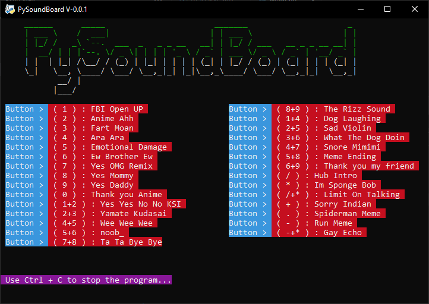

# 🎵 PySoundboard

I made this fun and colorful soundboard made with Python!  
Play all kinds of funny meme sounds instantly using your keyboard.  
**More features coming soon:** You'll be able to add your own sounds and custom buttons!

---

## 🚀 Features

- 29+ built-in meme & funny sounds
- Hotkey support: Press a key or key combo to play a sound
- Colorful terminal interface
- Easy to extend and customize
- Windows support

---


## 🖼️ Screenshot

>   
> _Sample terminal view of the soundboard_

---

## 🛠️ Requirements

- Python 3.8+
- [pygame](https://pypi.org/project/pygame/)
- [keyboard](https://pypi.org/project/keyboard/)
- [colorama](https://pypi.org/project/colorama/)

**Install requirements with:**

```sh
pip install pygame keyboard colorama
```
## 💻 Softwares Needed

-  [VoiceMeeter](https://vb-audio.com/Voicemeeter/index.htm)
-  [VB-CABLE](https://vb-audio.com/Cable/index.htm)

---
---

## ⚡ Installation & How to use!

1. **Clone this repository:**

   ```sh
   git clone https://github.com/lovelak-pro/PySoundBoard.git
   cd PySoundBoard
   ```

2. Make sure the `sfx` folder (with all the sound files) is in the same folder as `main.py`.

3. Install the required Python packages:

   ```sh
   pip install pygame keyboard colorama
   ```

4. Start the soundboard by running:

   ```sh
   python main.py
   ```

5. Look at the terminal to see which keys play which sounds.

6. Press the keys to play sounds!

7. To stop the soundboard, press `Ctrl + C` in the terminal.

---

## 🎯 Planned Features

- [✔] Built-in meme sounds
- [ ] Add your own sounds and buttons (coming soon!)
- [ ] GUI version

---

## 📁 Folder Structure

```
soundboard-using-python/
├── main.py
├── sfx/
│   ├── fbi-open-up-sfx.mp3
│   ├── anime-ahh.mp3
│   └── ... (other sound files)
└── screenshot.png
```

---

## 👨‍💻 Author

Created and maintained by [**Lovelak**](http://lovelak.rf.gd)

If you enjoy this project or have ideas for new features, feel free to open an issue!

---

Enjoy the memes and have fun using the soundboard!  
Your feedback and suggestions are always welcome.
